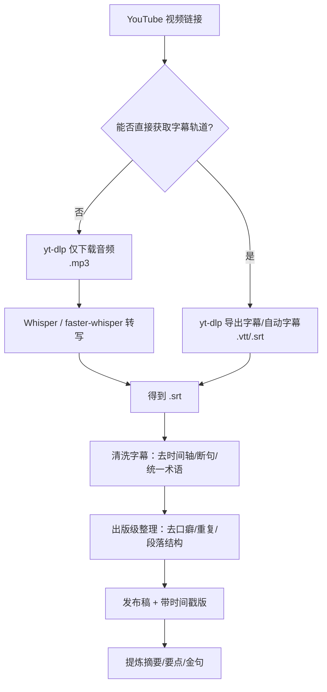
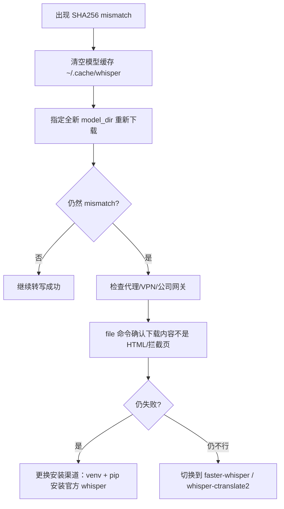

# 从 YouTube 无字幕到“出版级”访谈稿：Whisper 转写、排错与成稿全流程（含命令与流程图）

> 本文整合了本次对话里**所有关键步骤与产出**：当 YouTube 无法显示字幕时，如何导出/转写音频、解决 Whisper 模型校验报错（SHA256 mismatch），最终把 `.srt` 整理为**可发布的访谈稿**并总结要点。  
> 时间：2026-02-06（America/Los_Angeles）

---

## 1. 背景与目标

你希望从 YouTube 视频中**提取对话文字**。但遇到现实限制：

- **YouTube 当前无法显示字幕/转录（transcript）**
- 因此必须走「字幕导出」或「语音识别（ASR）」路线

最终目标是产出：

- `.srt`（字幕文件）
- 进一步清洗为：**补标点 + 分句润色（出版级整理稿）**
- 最后给出：**主要内容总结**

---

## 2. 路线总览（流程图）

下面是从视频到成稿的端到端流程（Mermaid）：



---

## 3. 方案 A：先确认“视频是否存在字幕轨道”（即使网页不显示）

即便网页端不显示字幕，有时仍然存在字幕轨道（包括自动字幕）。用 `yt-dlp` 查询最可靠：

```bash
yt-dlp --list-subs "https://youtu.be/I0DrcsDf3Os"
```

若列表里出现 `zh*` / `en*` 等语言标签，可直接导出：

```bash
yt-dlp --skip-download --write-auto-subs --write-subs --sub-langs "zh.*,en.*" --convert-subs srt "https://youtu.be/I0DrcsDf3Os"
```

---

## 4. 方案 B：没有字幕轨道时，用 Whisper 离线转写（ASR）

### 4.1 仅下载音频（避免下载完整视频）

```bash
yt-dlp -x --audio-format mp3 -o "%(title)s.%(ext)s" "https://youtu.be/I0DrcsDf3Os"
```

### 4.2 Whisper 生成 SRT（示例）

```bash
whisper "WengJiaLI.mp3" --language zh --task transcribe --output_format srt
```

---

## 5. 关键故障：Whisper 模型 SHA256 checksum mismatch（你遇到的报错）

你遇到的核心错误如下（简化）：

- `... exists, but the SHA256 checksum does not match`
- `RuntimeError: Model has been downloaded but the SHA256 checksum does not match`

这意味着：**模型文件下载内容与 Whisper 内置哈希不一致**，常见原因包括：
- 下载中断/文件损坏
- 网络层拦截/重写（公司网关、透明代理、安全软件等）
- 版本/打包链路差异（例如 Homebrew 打包的 whisper 与模型源不一致）

### 5.1 排错流程图（Mermaid）



### 5.2 你实际执行过的排错命令（关键记录）

清空缓存：

```bash
rm -rf ~/.cache/whisper
mkdir -p ~/.cache/whisper
```

确认无代理变量（你这里没有输出，说明未设置代理环境变量）：

```bash
env | egrep -i 'http_proxy|https_proxy|all_proxy|no_proxy'
```

强制使用新目录缓存模型：

```bash
whisper "WengJiaLI.mp3" --model small --language zh --task transcribe --output_format srt --model_dir /tmp/whisper_models
```

仍旧失败 → 推断为「系统性 mismatch」，于是采取替代路线（如 faster-whisper/whisper-ctranslate2）。

---

## 6. 最终落地：成功产出 SRT，并进入“出版级整理”

你最终提供了 **`WengJiaLI.srt`**。基于该 SRT，我们完成了三段式产出：

1) **去时间戳的纯文本稿**  
2) **合并段落的可读版**  
3) **出版级整理稿（去口癖 + 断句优化 + 统一术语）**  

并附带「带时间戳版」以便回听定位。

> 你随后选择了“更出版级”，于是进一步做了：  
> - 去口头语/重复（在不改变事实语义前提下）  
> - 修复断词、规范中英文空格与标点  
> - 将超长段落按句子边界拆分，形成更适合发布的版面结构  

---

## 7. 出版级编辑策略（本次访谈稿用到的规则）

### 7.1 统一术语与格式
- `OPEN-I / opini / opni` → `OpenAI`
- `post - training / post-\ntraining` → `post-training`
- 中英文混排：中文与英文/数字之间保留一个空格

### 7.2 去口癖（保守策略）
- 处理典型口头语：如“嗯、啊、那个、你知道、然后、其实、就是”等  
- 原则：**只删“口头填充”，不删信息**，避免改变观点或语气走向

### 7.3 断句与段落重构
- 将“长跑句”按句号/问号/感叹号优先切开  
- 若无句末标点，则在逗号处保守切分  
- 段落长度控制在易读范围（如 150–320 字）

---

## 8.（补充）访谈主题的技术背景：RL / post-training 的简化数学表达

为便于读者理解，我们用最简数学形式表达访谈涉及的概念（Markdown + LaTeX）：

### 8.1 强化学习目标

强化学习通常希望最大化期望回报：

$$
\max_{\pi_\theta} \; \mathbb{E}\left[\sum_{t=0}^{T} \gamma^t r_t\right]
$$

其中：
- $\pi_\theta$ 是参数化策略
- $r_t$ 是第 $t$ 步奖励
- $\gamma$ 是折扣因子

### 8.2 语言模型 post-training（非常粗略的抽象）

在对齐/偏好学习中，可把目标理解为让模型输出 $y$ 在给定输入 $x$ 时更符合“人类偏好”或“奖励模型”：

$$
\max_{\theta} \; \mathbb{E}_{(x,y)}\left[R(x,y)\right]
$$

或（把监督学习与奖励项合并的直觉表达）：

$$
\max_{\theta} \; \mathbb{E}\left[\log p_\theta(y\mid x)\right] + \lambda \mathbb{E}\left[R(x,y)\right]
$$

> 注：以上是帮助理解的“表达式级别”抽象，不等于具体实现细节。

---

## 9. 文章主要内容总结（基于本次访谈文本）

**访谈的核心主线**可以归纳为四块：

1) **成长与学习方法：兴趣驱动 + 投资未来**  
   - 数学兴趣与正反馈驱动；理解慢但一旦理解就能“用得很快”；偏好“投资未来”（提前学更有长期价值的东西）。

2) **价值观：打破信息差与追求 impact**  
   - 清华开源作业资料、开发工具型项目（如 RL 框架、签证查询系统）被视为一种“工具慈善”；强调“真实需求”与“可用性”。

3) **学术 vs 工业：评价体系与职业选择**  
   - 质疑 GPA/论文数量等单一指标，倾向于自建评价体系（项目/工程能力/开源影响力）；对读博的工业界性价比持怀疑态度。

4) **OpenAI 实战：post-training + RL infra 是迭代效率的关键**  
   - 强烈强调“infra / 工程闭环 / 修 bug / 迭代速度”在大模型时代的重要性；idea 相对便宜，验证与系统能力才决定生产力。

此外，访谈延伸到：
- 组织效率与信息流通（大公司变慢是客观规律）
- agent/自动化对未来工作的影响（研究与工程的替代顺序与瓶颈）
- 更抽象的宿命论/确定性世界观讨论（但仍建议“继续体验生活、投资未来以保留选择权”）

---

## 10. 你可以直接复用的“实操命令清单”

### 10.1 先查字幕轨道
```bash
yt-dlp --list-subs "https://youtu.be/I0DrcsDf3Os"
```

### 10.2 导出字幕（如果存在）
```bash
yt-dlp --skip-download --write-auto-subs --write-subs --sub-langs "zh.*,en.*" --convert-subs srt "https://youtu.be/I0DrcsDf3Os"
```

### 10.3 无字幕时下载音频
```bash
yt-dlp -x --audio-format mp3 -o "%(title)s.%(ext)s" "https://youtu.be/I0DrcsDf3Os"
```

### 10.4 Whisper 转写（基础用法）
```bash
whisper "WengJiaLI.mp3" --language zh --task transcribe --output_format srt
```

### 10.5 Whisper 校验报错排错（关键点）
```bash
rm -rf ~/.cache/whisper
mkdir -p ~/.cache/whisper
whisper "WengJiaLI.mp3" --model small --language zh --task transcribe --output_format srt --model_dir /tmp/whisper_models
```

---

# Get Transcript from YouTube Captions (CC)

When a video already has captions (manual or auto-generated), you can download them and convert to plain text without doing any speech-to-text.

## Option A: `yt-dlp` (recommended)

### 1) Download captions only (no video)

```bash
# Auto-captions (most common)
yt-dlp --skip-download --write-auto-sub --sub-lang "en.*" \
  --convert-subs vtt -o "%(title)s.%(ext)s" "<YOUTUBE_URL>"

# If you want human-made subtitles instead of auto:
yt-dlp --skip-download --write-sub --sub-lang "en.*" \
  --convert-subs vtt -o "%(title)s.%(ext)s" "<YOUTUBE_URL>"
```

This produces a `.vtt` file (WebVTT).

### 2) Convert `.vtt` → plain text

```bash
# macOS / Linux
sed -E 's/<[^>]+>//g' *.vtt | grep -vE '^(WEBVTT|NOTE|[0-9]{2}:[0-9]{2}:[0-9]{2}\.)' \
  | sed '/^$/d' > transcript.txt
```

If the output contains duplicated lines (common in auto-captions), a simple de-dup pass can help:

```bash
awk 'NF && $0!=prev {print} {prev=$0}' transcript.txt > transcript.dedup.txt
```

## Option B: Copy from YouTube UI

If the UI shows “Show transcript”, you can copy-paste it directly. This is fast, but harder to automate and may lose punctuation/formatting.

## Notes / Caveats

- Some videos have no captions at all; in that case use audio transcription (e.g. Whisper).
- Captions are language-specific; adjust `--sub-lang` (e.g. `zh-Hans`, `zh`, `ja`, `ko`).
- Respect YouTube’s Terms of Service and local laws when downloading content.

