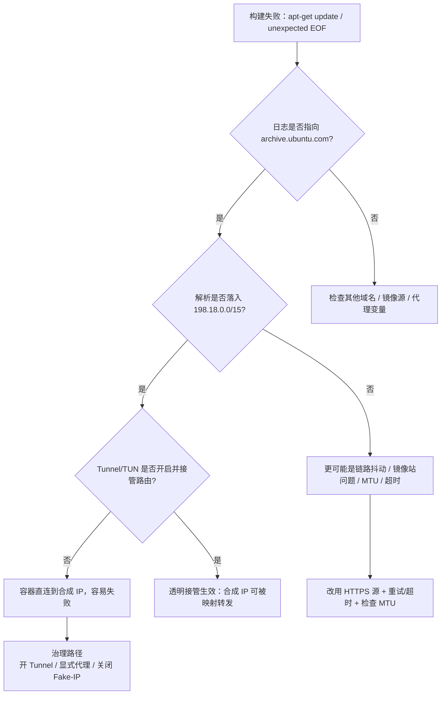

# macOS + Docker + Shadowrocket：从 `unexpected EOF` 到可复现的网络诊断与治理（含 Fake-IP / Tunnel / 显式代理）

> 场景：在 macOS 上执行 `docker compose -f docker-compose-macos.yml up -d --build` 时，构建阶段出现 APT 拉包失败（典型报错 `unexpected EOF`），并伴随解析到 `198.18.x.x` 的异常现象。本文把排查过程、结论与可落地的治理方案整合成一份可复用的工程笔记。

---

## 1. 代理（Proxy）概念：4 个难度梯度递增的解释

### 1.1 入门：代理是什么？

代理 = 网络转发中间站：

> 客户端 → 代理 → 目标站点

用于改善可达性、统一出口、加速、策略路由等。

### 1.2 实用：HTTP/HTTPS 代理 vs SOCKS5

- **HTTP/HTTPS 代理：** 适合 Web 流量；HTTPS 常用 `CONNECT` 建隧道。
- **SOCKS5 代理：** 更通用（按地址/端口转发字节流），但不是所有工具都原生支持。

### 1.3 进阶：显式代理 vs Tunnel（透明接管）

- **显式代理：** 应用层配置代理（Docker Desktop Proxies、`HTTP_PROXY`）。
- **Tunnel：** 系统层接管路由/DNS，把不支持代理的流量也纳入转发。

### 1.4 严谨：HTTPS CONNECT、DNS、NO_PROXY、证书与可审计性

HTTPS 代理典型链路：

1. Client 连接 proxy
2. Client 发 `CONNECT host:443`
3. Proxy 回 `200 Connection established`
4. TLS 在隧道内完成（除非 MITM 解密）

配套关键点：

- `HTTP_PROXY/HTTPS_PROXY`
- `NO_PROXY`（避免内网/本机走代理）
- DNS 策略（由谁解析、是否污染）
- 证书信任（仅在代理进行 HTTPS 解密时需要）

---

## 2. 问题现象与关键线索

典型报错（构建阶段 `apt-get update`）：

- `writing response to archive.ubuntu.com:80: reading HTTP GET: unexpected EOF [IP: 198.18.0.21 80]`

关键线索有两个：

1. **目标域名：** `archive.ubuntu.com:80`
2. **目标 IP：** `198.18.0.21`

其中 `198.18.0.0/15` 是保留网段（常用于基准测试/实验用途），公网镜像站不应解析到该网段；这高度提示：**DNS 返回了合成 IP（Fake-IP / Synthetic IP），并依赖“透明接管/隧道”完成转发**。

---

## 3. 为什么“打开 Tunnel 反而可用”？

在 Shadowrocket 这类工具中，常见有两套机制：

- **显式代理（Explicit Proxy）：** 应用显式把请求发到本机代理端口（HTTP/HTTPS/SOCKS5）。
- **透明代理 / 隧道（Transparent Proxy / TUN）：** 应用仍以“直连”方式访问目标，但系统层通过 Packet Tunnel 拦截流量并重定向到代理链路。

当启用 Tunnel 且配置为 **Include All Networks / Enforce Routes** 时，Shadowrocket 会：

1. 在系统层接管路由与（往往也包括）DNS；
2. 把域名解析成 **合成 IP（如 198.18.x.x）**；
3. 当应用访问这个合成 IP 时，Shadowrocket 在隧道中识别并将其映射回真实域名/真实目标，完成转发；
4. 因此 **即使应用/容器并未配置显式代理**，流量仍能被接管，从而“变得可用”。

反之，如果没有 Tunnel，容器/构建流量往往不会自动走系统代理；若同时 DNS 仍给出 Fake-IP，那么应用会去直连 `198.18.x.x:80`，就会出现超时、连接中断或 `unexpected EOF`。

---

## 4. 一个重要“误判点”：arm64 与 amd64 的 APT 源不同

在 Apple Silicon 上，默认运行的 Ubuntu 容器多为 **arm64（aarch64）**。Ubuntu 的官方源在不同架构下默认不同：

- **arm64：** 主要走 `ports.ubuntu.com`
- **amd64：** 主要走 `archive.ubuntu.com`

因此，如果你测试的是：

```bash
docker run --rm ubuntu:24.04 bash -lc "apt-get update"
```

在 `aarch64` 下你会看到 APT 实际访问的是 `ports.ubuntu.com`，它不一定触发 `archive.ubuntu.com` 的那条失败链路。要复现你最初的报错路径，需要强制 amd64，例如：

```bash
docker run --rm --platform=linux/amd64 ubuntu:24.04 bash -lc "uname -m; apt-get update -o Acquire::Retries=1"
```

---

## 5. 复现与验证：把“猜测”变成“证据”

### 5.1 观察解析结果：是否仍返回 Fake-IP

系统侧（macOS）：

```bash
dscacheutil -flushcache
sudo killall -HUP mDNSResponder
nslookup archive.ubuntu.com
```

你曾看到的典型输出：

- `Server: 198.18.0.2`
- `Address: 198.18.0.2#53`
- `Name: archive.ubuntu.com`
- `Address: 198.18.0.14`

这说明系统 DNS 被 Shadowrocket 的 DNS handler 接管，并返回合成 IP。

### 5.2 用 DoH 获取“真实答案”（绕开 53 端口限制）

在受控网络中，直连公共 DNS（UDP/TCP 53）可能被屏蔽，导致：

- `nslookup archive.ubuntu.com 1.1.1.1` 超时
- `nslookup archive.ubuntu.com 8.8.8.8` 超时

此时应使用 DoH（HTTPS/443）验证真实 A 记录：

```bash
curl -s 'https://dns.google/resolve?name=archive.ubuntu.com&type=A' | python -m json.tool
```

你得到的真实结果包含：

- `91.189.91.82`
- `185.125.190.82`
- `185.125.190.83`
- 等多条公网 IP

这证明：**真实解析 ≠ 198.18/15**，Fake-IP 来自本机代理链路，而非权威 DNS。

---

## 6. `private-ip-answer=false` 的意义与局限

你在 `default.conf` 中设置了：

```ini
private-ip-answer = false
```

但系统解析仍返回 `198.18.*`。原因在于：

- `private-ip-answer` 的语义（从配置注释可见）偏向于 **“当解析结果是私网地址（RFC1918 等）时，如何判断 DNS 被劫持并强制走代理”**。
- 它并不必然等价于“关闭 Fake-IP 合成机制”。

因此，即使 `private-ip-answer=false` 生效，**在 Tunnel 模式下 Shadowrocket 仍可能继续使用 Fake-IP（198.18/15）作为透明转发的实现方式**。

---

## 7. 从“现象”到“根因”的决策树（Markdown 流程图）

下面用 Mermaid 把排查路径结构化（可直接粘贴到支持 Mermaid 的 Markdown 渲染器）：



---

## 8. 两种“可治理”的工程路径

### 路径 A：显式代理（推荐长期工程化）

目标：让 Docker 明确走代理，而不是依赖 Tunnel/Fake-IP 透明接管。

#### 8.1 在 Docker Desktop 配置代理

Docker Desktop → **Settings → Proxies**：

- HTTP Proxy：`http://<HOST>:<PORT>`
- HTTPS Proxy：`http://<HOST>:<PORT>`
- NO_PROXY：建议至少包含：
  - `localhost,127.0.0.1,*.local,10.0.0.0/8,172.16.0.0/12,192.168.0.0/16`

#### 8.2 Shadowrocket 的“本地端口”在哪里查？

**方式 1（UI）：** Shadowrocket → **Settings → Proxy**，查看：
- HTTP Proxy Port / Local HTTP Port
- SOCKS5 Port / Local SOCKS Port

**方式 2（命令行最准确）：**

```bash
sudo lsof -nP -iTCP -sTCP:LISTEN | grep -i shadowrocket
```

输出中的 `:PORT` 即为端口。

#### 8.3 端口连通性快速验证

HTTP 代理验证：

```bash
curl -I -x http://127.0.0.1:PORT https://archive.ubuntu.com/ubuntu/ --max-time 5
```

SOCKS5 验证：

```bash
curl -I --socks5-hostname 127.0.0.1:PORT https://archive.ubuntu.com/ubuntu/ --max-time 5
```

> 注：若 Docker Desktop 的 Linux VM 访问不到 `127.0.0.1:PORT`，可尝试 `host.docker.internal:PORT`（视你的 Docker Desktop 版本与网络设置而定），并确保 Shadowrocket 允许本机/局域网连接（若有该开关）。

---

### 路径 B：继续使用 Tunnel，但减少副作用（适合短期/不改造）

如果你必须依赖 Tunnel（例如某些流量不支持显式代理），建议：

1. 保持 Tunnel 开启；
2. 通过规则与路由排除内网（避免影响局域网服务）；
3. 针对 Docker 常见网段设置直连或例外（视工具能力而定），例如：
   - `192.168.0.0/16`
   - `172.16.0.0/12`
   - `10.0.0.0/8`

---

## 9. APT 构建稳定性增强（与代理无关但能显著降噪）

即使代理链路正确，镜像站/链路抖动也可能导致中断。建议在 Dockerfile 中加入：

- 使用 HTTPS 源
- 增加重试与超时

示例：

```dockerfile
RUN sed -i 's|http://archive.ubuntu.com|https://archive.ubuntu.com|g' /etc/apt/sources.list  && apt-get update     -o Acquire::Retries=5     -o Acquire::http::Timeout=30     -o Acquire::https::Timeout=30
```

---

## 10. 用两个公式把“网络耗时/成功率”抽象出来（便于解释与汇报）

### 10.1 总耗时分解

一次成功拉取包索引的总耗时可粗略写为：

\[
T_{\text{total}} = T_{\text{DNS}} + T_{\text{TCP}} + T_{\text{TLS}} + T_{\text{HTTP}} + T_{\text{transfer}}
\]

当 DNS 返回 Fake-IP 且缺乏透明接管时，\(
T_{\text{TCP}}
\) 常直接变成“失败/超时”。

### 10.2 重试带来的成功率提升

若单次请求成功概率为 \(p\)，最多重试 \(n\) 次（独立近似），至少成功一次的概率为：

\[
P_{\text{success}} = 1 - (1-p)^n
\]

这解释了为什么 `Acquire::Retries` 在链路抖动时能显著提升构建成功率。

---

## 11. 最小可复用的“验证清单”

建议以后每次遇到类似问题，按以下最小清单复核：

1. **确认架构与 APT 源：**
   ```bash
   docker run --rm ubuntu:24.04 bash -lc "uname -m; cat /etc/apt/sources.list.d/ubuntu.sources 2>/dev/null || cat /etc/apt/sources.list"
   ```

2. **强制复现 amd64（若历史报错指向 archive）：**
   ```bash
   docker run --rm --platform=linux/amd64 ubuntu:24.04 bash -lc "uname -m; apt-get update -o Acquire::Retries=1"
   ```

3. **DoH 校验真实 DNS：**
   ```bash
   curl -s 'https://dns.google/resolve?name=archive.ubuntu.com&type=A' | python -m json.tool
   ```

4. **检查系统解析是否仍落入 198.18/15：**
   ```bash
   nslookup archive.ubuntu.com
   ```

5. **显式代理连通性测试（若走 Docker Proxies）：**
   ```bash
   curl -I -x http://127.0.0.1:PORT https://archive.ubuntu.com/ubuntu/ --max-time 5
   ```

---

## 12. 总结：你最终要做的选择

- 如果目标是“**可控、可审计、少副作用**”：优先选择 **Docker Desktop 显式代理（Proxies）**；
- 如果目标是“**最少配置、尽快能跑**”：开启 Tunnel 并让其接管所有网络；
- 无论选择哪条路：建议 **APT 改 HTTPS + 增加重试/超时**，把随机网络抖动从构建中剔除。

---

*本文基于一次真实排障对话整理；示例命令均可直接在 macOS 终端执行。*
